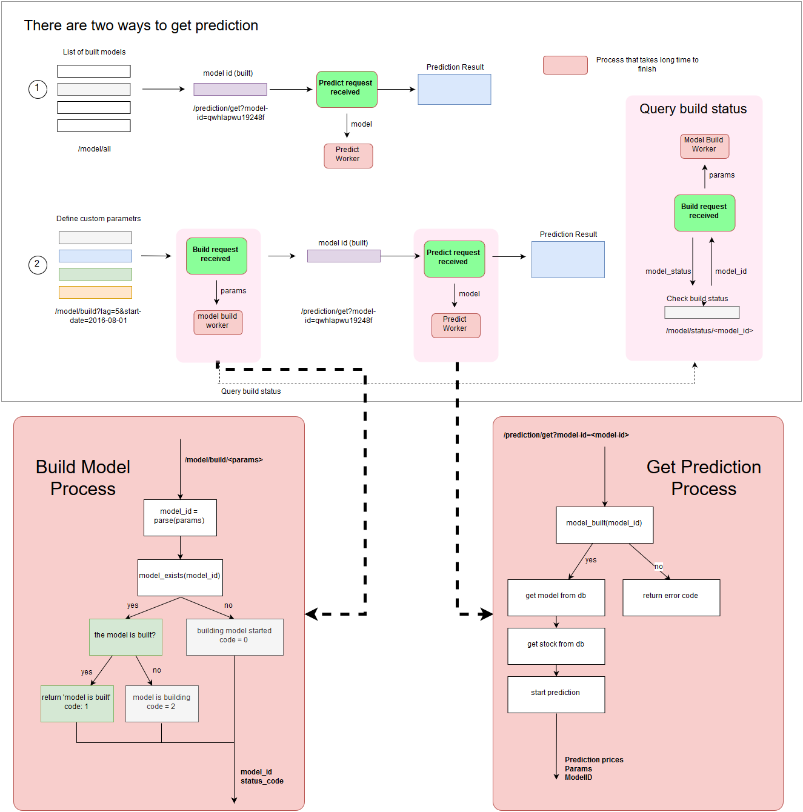

# Stocker Service: Prediction Model Builder

> Created by NQT on Dec 6th 2018

## Process

`Build The Model` > *Wait until the model is built* > `Get Prediction using the model_id`s



## APIs

### Models

1. Build Model | `/model/build/<string:ticker>`

    **What**: send BUILD signal, start building prediction model
    
    **Method**: `POST`
    
    **Parameters**: `<param_name> | <default_value>`
    - `lag`* | `5` : to specify the lag of the moving average
    - `start-date`* | `2016-08-01`: the date to start predict the future
    - `prior` | `0.05`: change point prior scale, how the change points affect the increase/decrease of the data
    - `seasonalities` | `m-y-q`: what type of seasonalities is going to affect the model (`d`: day, `w`: week, `m`: month, `q`: quarter, `y`: year)
    
    **Example request:**
    - `/model/build/VIC/lag=5&start-date=2016-08-01`
    - `/model/build/VIC/lag=10&start-date=2016-08-01&prior=0.5&seasonalities=d-w-m-y`

    **Example response:**
    ```json
    {
        // prediction model is new, build process started
        "status": "started",
        "status_code": {
            "model_id": "0f5a4258654591461682644c2ac6b1d49a456d633d307df4ac64f87ddbc80718",
            "status": 0
        }
    }
    ```

    ```json
    {
        // prediction model is being build
        "status": "in progress",
        "status_code": {
            "model_id": "0f5a4258654591461682644c2ac6b1d49a456d633d307df4ac64f87ddbc80718",
            "status": 2
        }
    }
    ```

    ```json
    {
        // model build finished, no action required
        "status": "finished",
        "status_code": {
            "model_id": "0f5a4258654591461682644c2ac6b1d49a456d633d307df4ac64f87ddbc80718",
            "status": 1
        }
    }
    ```

2. Get Model Status | `/model/status/<string:model_id>`

    **What**: Check `Build Status` of the model using `model_id`

    **Method**: `GET`

    **Status code**:
    - `0` : Build process STARTED
    - `1` : Build process COMPLETED
    - `2` : Build process IN PROGRESS
    
    **Example**:
    - `model/status/0f5a4258654591461682644c2ac6b1d49a456d633d307df4ac64f87ddbc80718`
    
    **Response**:
    ```json
    {
        "model_id": "0f5a4258654591461682644c2ac6b1d49a456d633d307df4ac64f87ddbc80718",
        "status": 1
    }
    ```
3. Get Model List | `/model/all/`

    **What**: Get all built models

    **Method**: `GET`

    **Example**:
    -`/model/all`

### Prediction

**ATTENTION**: TO GET PREDICTION TO WORK, MODEL HAS TO BE BUILT FIRST

1. Get prediction | `/prediction/get?model-id=<model-id>`

    **What**: get prediction from the specified model

    **Method**: `GET`

    **Paramters**:
    - `model-id`*: the model id of the [built model](#Models)
  
    **Response**:
    - If the model is being built, the response will be the status of the model
    - If the model is not built yet, the reponse will be status of the model and the model has to be [build](#Models)
    - If the model is built, the response will be the predicted price 
    ```json
    {
        "params": 
            {
                "ticker": "VNM", 
                "daily_seasonality": false, 
                "weekly_seasonality": false, 
                "monthly_seasonality": true, 
                "yearly_seasonality": true, 
                "quarterly_seasonality": true, 
                "changepoint_prior_scale": 0.05, 
                "training_years": 10, 
                "date": "2016-08-01T00:00:00", 
                "lag": 5
            }, 
            "status": 
                {
                    "model_id":"d7502877c8d61ac51b033a81faf5ddbdb8940b0eb1321e43c4b618b817d31e79", 
                    "status": 1
                }, 
            "prediction": [{}]
    ```